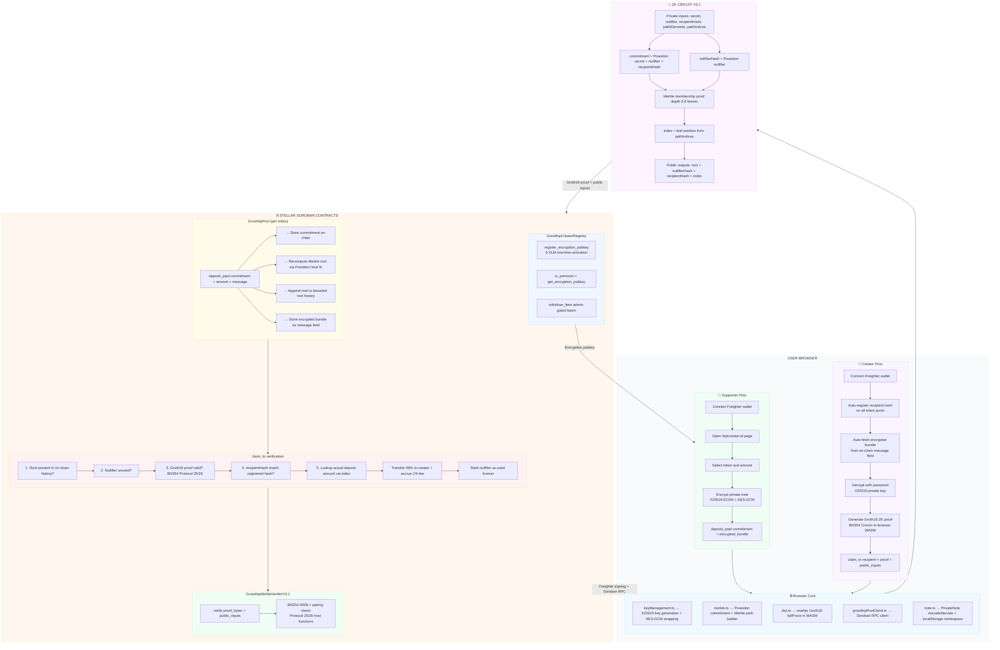

# Growthip 🌱
### Privacy-Preserving Creator Tipping on Stellar

> *Support creators without exposing the relationship.*

Growthip is a privacy-preserving creator tipping protocol built on **Stellar Soroban**, using **Groth16 zero-knowledge proofs** with **native BN254 verification** enabled by Stellar Protocol 25 (X-Ray) and Protocol 26 (Yardstick), plus **end-to-end encrypted note delivery** so the claim data needed to unlock a tip never travels in plaintext.

A supporter deposits a fixed-denomination tip into a shared pool. The creator later claims it using a ZK proof. The public chain records both events — but cannot trivially link which deposit corresponds to which claim.

```text
supporter deposits → pool stores commitment → on-chain root updates
note encrypted     → only the creator's browser can decrypt it
creator claims     → ZK proof verifies note membership + deposit amount
nullifier consumed → double-claim prevented forever
```

> ⚠️ Hackathon prototype. Stellar Testnet only. Not audited. Do not use with real funds.

---

## Table of Contents

- [Live Demo](#live-demo)
- [Why Growthip](#why-growthip)
- [Prior Art and How Growthip Differs](#prior-art-and-how-growthip-differs)
- [What Makes Growthip Distinctive](#what-makes-growthip-distinctive)
- [Testnet Deployment](#testnet-deployment)
- [Protocol Design](#protocol-design)
- [Creator Links & Sharing](#creator-links--sharing)
- [Premium: Private Notes & Analytics](#premium-private-notes--analytics)
- [Security History (Honest Disclosure)](#security-history-honest-disclosure)
- [Fee Model](#fee-model)
- [ZK Circuit](#zk-circuit)
- [Soroban Contracts](#soroban-contracts)
- [Project Structure](#project-structure)
- [Local Development](#local-development)
- [Responsible Privacy](#responsible-privacy)
- [Roadmap](#roadmap)
- [Prototype Notice](#prototype-notice)
- [License](#license)

---

## Live Demo
* **URL:** [https://growthip.vercel.app](https://growthip.vercel.app)
* **Network:** Stellar Testnet
* **Wallet:** Freighter

---

## Why Growthip

On every public blockchain, every payment is permanent and visible:

```text
supporter wallet → creator wallet → amount → timestamp
```

For creators and supporters, this creates real friction:

* A donor cannot support a controversial creator without public association
* An open-source maintainer cannot receive donations without exposing income
* A student builder cannot accept community support without family judgment
* A community admin cannot reward contributors without triggering social dynamics

Growthip solves this with a ZK privacy pool: supporters deposit into a shared pool, share an encrypted note off-chain, and creators claim using a zero-knowledge proof. The on-chain link between supporter and creator is cryptographically broken, and the claim data itself travels encrypted, not as plaintext.

**This is not a mixer.** Growthip is an application-specific tipping protocol for creator support, with fixed small denominations, recipient registration, and honest compliance framing.

---

## Prior Art and How Growthip Differs

Growthip builds on the Stellar ecosystem's open privacy primitives. The most
advanced open-source reference is:

**NethermindEth/stellar-private-payments (SPP)** — an SDF-promoted,
proof-of-concept privacy-payments system using Soroban pool contracts,
Circom + Groth16, browser-based WASM proving, UTXO-style note semantics, and
Association Set Providers (ASPs) for membership/non-membership compliance
controls. SPP is explicitly a research PoC: not audited, not intended for
production use with real assets. The earliest Stellar privacy-pool prototypes
(e.g. the original SDF research example) used BLS12-381; the Stellar ZK
ecosystem has since converged on BN254 via the Protocol 25/26 host functions.

Growthip acknowledges SPP as an architectural predecessor and shares its broad
shape (a shielded Soroban pool with Circom/Groth16 proofs). It is built on the
same **BN254 / Protocol 25/26** foundation rather than competing on curve
choice. Where Growthip differs is in design intent and several concrete
mechanisms:

1. **Creator-tipping focus, not general payments** — SPP targets general
   private transfers and institutional compliance (ASP membership gating).
   Growthip is a complete tipping product: shareable creator tip links
   (`/tip/[id]`), QR codes, a busy-creator claim dashboard, and a
   self-sustaining premium model — not a general-purpose framework.
2. **V3 circuit recipient binding** — `commitment = Poseidon(secret, nullifier, recipientHash)`
   binds the recipient at circuit level, not just contract level, preventing
   recipient substitution even if the note is stolen.
3. **V3.1 circuit deposit-amount binding** — the circuit additionally exposes
   the deposit's Merkle leaf `index` as a public output, letting the pool pay
   out the *actual* amount deposited (1x/5x/10x/20x the base unit) instead
   of a flat base unit — see [Security History](#security-history-honest-disclosure)
   for how a real bug here was found and fixed via a live testnet transaction.
4. **End-to-end encrypted note delivery** — X25519 ECDH + AES-GCM, with the
   creator's encryption identity protected by a password *and* an
   independent recovery phrase, never the wallet's own Stellar key (which
   no Freighter-class wallet exposes for this purpose).
5. **Private deposit()** — prevents free commitment spam (a griefing vector).
6. **On-chain trustless root history** — the Merkle root is recomputed
   on-chain via the native Poseidon host function on every deposit, and
   claims are validated against a bounded on-chain root history. No admin
   ever sets or signs off on the root.
7. **pool upgrade()** — enables protocol upgrades without losing state.

These are differences in application design and circuit-level guarantees, not
claims of cryptographic superiority over SPP. Both are early-stage,
testnet/PoC-grade systems; Growthip's contribution is showing this privacy
pattern working end-to-end for a specific consumer use case, with 37 passing
tests across an 8-crate contract workspace.

## What Makes Growthip Distinctive

Growthip combines several capabilities that, together, are uncommon on Stellar
today. Rather than claim primacy on the underlying primitives (the BN254
verifier and on-chain Poseidon Merkle tree are now shared building blocks used
by SPP and others), Growthip's distinctive combination is:

* ✅ A native Groth16 BN254 verifier built on Protocol 25/26 host functions
* ✅ An on-chain Poseidon Merkle tree — root recomputed natively on-chain via
  the `poseidon_permutation` host function on every deposit, not admin-submitted
* ✅ ZK Merkle membership proofs applied to a working **creator tipping** flow
* ✅ A complete deposit → note → proof → claim cycle verified on Stellar Testnet
* ✅ `recipientHash` binding at circuit level (V3) — not just contract level
* ✅ A ZK-circuit-derived deposit index (V3.1) so claims pay out the actual
  amount deposited, while keeping the depositor's identity private
* ✅ On-chain ZK privacy combined with end-to-end encrypted off-chain note
  delivery, gated by a self-sustaining on-chain premium model

The novel contribution is not any single primitive but this end-to-end
combination, delivered as a usable tipping product rather than a framework.

CAP-0075: Cryptographic Primitives for Poseidon/Poseidon2 Hash Functions defines host functions that expose the core permutation primitives behind Poseidon and Poseidon2, addressing a key performance bottleneck for hashing inside ZK-friendly applications, shipped in Protocol 25 (X-Ray). CAP-0080 in Protocol 26 (Yardstick) builds on the BN254 work from X-Ray, adding nine new host functions for BN254 multi-scalar multiplication, scalar-field arithmetic, and curve-membership checks. Growthip uses the Poseidon host function directly to compute its Merkle root on-chain — not just to verify a Groth16 proof, but to eliminate the need for any admin-submitted root entirely.

---

## Testnet Deployment

### Current Contracts — deployed with `soroban-sdk 26.0.1`

| Contract | Address |
|---|---|
| Growthip Merkle Verifier V3.1 | `CA5IHK2NAUVQ6NLS7CWSGPZWEXY6CAFAQBLMM43GCKSFYC2BZXZQIA2L` |
| Growthip Pool — XLM | `CBNENJSASWTULXMJT3MI35Z4MZRY5WVNB6MROEVQIU5TBVEGPKRZOKMK` |
| Growthip Pool — USDC | `CBKTJKSGQ7Y4WOLM6PQWNKHTHMYQ2MBWPZJYCH3KNZPK7SERD5ZGAXK7` |
| Growthip Creator Registry | `CDX52ACO6MVXDBC4IS3AG6NIKQASJLY24BED3S5KJEA4PPPAXTWSRGNU` |
| Native XLM Token (SAC) | `CDLZFC3SYJYDZT7K67VZ75HPJVIEUVNIXF47ZG2FB2RMQQVU2HHGCYSC` |
| USDC Token (SAC) | `CA2R3TBJRDGPAPIXZXVBAZDD63Q5HLJF7JFOLIPBABMDMWJAJ6AV7ZUY` |
| Admin / Treasury | `GDPAPDZWAKBXUPCNMI4YHAZ7DS7UOUTPGXAFDSWZG4URRMWHFSQTDQBM` |
| Tip Amount — XLM pool | `100,000,000 stroops = 10 XLM` (base; 5x/10x/20x also accepted) |
| Tip Amount — USDC pool | `1,000,000 stroops = 0.1 USDC` (base; 5x/10x/20x also accepted) |
| Premium activation fee | `60,000,000 stroops = 6 XLM` (one-time, global per creator) |
| Network | Stellar Testnet |

> Contracts have been redeployed multiple times from earlier versions,
> after three self-discovered issues were found and fixed — a
> root-validation vulnerability, a verifier interface leak, and a
> deposit-amount payout bug. The XLM pool has been redeployed multiple
> times during testnet to expand `MAX_MESSAGE_LEN` (50 → 2048 bytes)
> for encrypted bundle delivery, and to reset the 8-leaf Merkle tree
> as it fills up during testing. See
> [Security History](#security-history-honest-disclosure) below for all
> three, each verified working on real testnet transactions, not just in
> local tests.

---

## Protocol Design




### Privacy Model

Growthip implements a **fixed-denomination privacy pool** model:

1. **Supporter calls `deposit_paid(commitment, amount, message?)`**
   * → tip locked in pool (1x/5x/10x/20x base denomination)
   * → commitment stored on-chain (anonymous — no identity link)
   * → an optional **encrypted bundle** (max 2048 bytes) is stored on-chain
     as the `message` field — the supporter's browser encrypts the private
     note *before* depositing, so the creator can auto-fetch and decrypt it
     without any manual copy-paste. A plain public donor message (max 50 chars,
     legacy) is also supported as a fallback
   * → **the pool recomputes its Merkle root on-chain**, using the native
     Poseidon host function, and appends the new root to an on-chain
     bounded root history
2. **Supporter's browser encrypts the private note for the creator**
   * → note contains: `secret`, `nullifier`, `recipientHash`, Merkle
     path, the V3.1 `index`
   * → encrypted with X25519 ECDH + AES-GCM against the creator's
     published encryption public key (`growthip-creator-registry`) —
     only the creator's browser, holding the matching private key, can
     decrypt it
   * → the encrypted bundle is shared via the tip link's resulting
     screen, as text or a QR code
3. **Creator calls `register_recipient(recipient, recipient_hash)`**
   * → binds their wallet to their expected `recipientHash`
   * → done automatically the first time a creator connects their wallet
     to the dashboard, on every available token pool
4. **Creator's browser decrypts the note, then generates a Groth16
   proof from it**
   * → proof proves: valid note + Merkle membership + unused nullifier +
     the deposit's leaf index (V3.1)
5. **Creator calls `claim_to(recipient, proof_bytes, public_inputs)`**
   * → contract verifies, in order: **root is present in on-chain root
     history** → nullifier unused → proof valid → recipient hash match
   * → looks up the deposit's *actual* amount via the proof's index output
   * → 99% of that actual tip amount transferred to creator, 1% accrues
     as platform fee (see [Fee Model](#fee-model))
   * → nullifier marked as used (forever)

### What Is Public
* ✅ Deposit timestamps
* ✅ Withdrawal timestamps
* ✅ Pool balance
* ✅ Total deposits / total claims
* ✅ Commitment list (anonymous — not linked to identity)
* ✅ Used nullifier list (anonymous — not linked to secret)
* ✅ Root history (anonymous — just a list of hashes, not linked to depositors)
* ✅ A deposit's optional on-chain message field (encrypted bundle or plain donor message — stored on-chain, max 2048 bytes, not linked to the depositor's identity)
* ✅ A premium creator's encryption public key (necessary for supporters
  to encrypt notes — a public key, not a secret)

### What Is Protected
* 🔒 Link between supporter wallet and creator wallet
* 🔒 Tip amount granularity (within a fixed denomination tier — all deposits
  at a given tier are identical)
* 🔒 Secret and nullifier preimage (never leave the browser)
* 🔒 The private note's contents in transit (end-to-end encrypted, once
  the creator has activated premium)

### Known Limitations
* ⚠️ Deposit and withdrawal timestamps are public — timing correlation is possible
* ⚠️ Small anonymity set on testnet (max 8 leaves per Merkle tree) — privacy
  improves with more participants and larger trees
* ⚠️ Private note encryption is opt-in and paid (6 XLM) — a creator who
  hasn't activated it cannot receive tips at all, rather than receiving
  them with weaker privacy. See [SECURITY.md](SECURITY.md) for the full
  trust-model writeup, including key-loss and recovery trade-offs
* ⚠️ Platform fee withdrawal (`withdraw_fees`) is a batch operation,
  deliberately disconnected in time from any individual claim to avoid
  linking a specific claim to a treasury-incoming transfer — but the
  treasury address itself is public, so aggregate fee revenue is observable
* ⚠️ A creator's real wallet address is unavoidably revealed on-chain the
  moment they claim — the cosmetic tip-link obfuscation (see
  [Creator Links & Sharing](#creator-links--sharing)) only avoids exposing
  the raw address in a casually-shared URL, it is not cryptographic privacy
* ⚠️ Receiving USDC (or any non-native asset) requires the creator's wallet
  to already have an open Stellar trustline to that asset — this is a
  Stellar-level requirement, not something Growthip can bypass
* ⚠️ Not audited — do not use with real funds

---

## Creator Links & Sharing

Every connected wallet gets a personal, shareable tip page at
`growthip.vercel.app/tip/<id>`, where `<id>` is the creator's Stellar
address transformed with a reversible base62 encoding
(`apps/web/src/lib/addressId.ts`).

**This is cosmetic obfuscation, not cryptographic privacy.** The transform
is publicly computable in both directions — anyone opening the link can
decode it back to the real address, because the supporter's browser needs
to know where to send the tip. Its only purpose is avoiding a raw
56-character Stellar address sitting in a casually-shared URL. The
creator's real address is still fully visible on-chain the instant they
call `register_recipient()` or `claim_to()` — this does not and cannot
hide that.

The Settings page provides: a profile (avatar, display name, bio — all
local-only, never published on-chain), an address copy button, and a
tip-link card with copy and QR code.

The public tip page (`apps/web/src/app/tip/[id]/page.tsx`) lets a
supporter, without ever creating an account: connect Freighter, pick a
token and preset amount, optionally attach a public on-chain message (max
50 characters), deposit, and receive/share their resulting encrypted
private note — including as a QR code the creator can scan directly. If
the creator hasn't activated premium, the page shows a banner instead of
a deposit form, since private notes are mandatory.

---

## Premium: Private Notes & Analytics

A one-time, on-chain payment (6 XLM, paid to `growthip-creator-registry`)
unlocks two creator-facing features:

* **Encrypted private notes** — described above and in
  [SECURITY.md](SECURITY.md)
* **Analytics dashboard** — pool statistics and claimed-tip history

Activation also publishes the creator's X25519 encryption public key
on-chain, which is what makes the first feature possible at all — a
supporter's browser needs somewhere public to read that key from before
it can encrypt a note.

This is deliberately a **separate contract** from `growthip-pool`, not a
field added to it: `growthip-pool` is deployed once *per token*, but
premium status is a property of the creator's identity, not of "the
creator within one specific pool" — putting it in the pool would mean
paying the activation fee once per token. See
[contracts/README.md](contracts/README.md#growthip-creator-registry--structure)
for the contract-level reasoning.

Key rotation (e.g. restoring access on a new device via recovery phrase,
and publishing the resulting new public key) does not re-charge the fee
— only the very first activation does.

---

## Security History (Honest Disclosure)

This section exists because Growthip's design changed materially during
development, and we believe documenting *why* is more credible than
pretending the final design was always the plan. Full technical writeups,
including exact attack steps and on-chain transaction evidence, are in
[SECURITY.md](SECURITY.md).

### Issue #1 — Root Forgery (Critical, fixed)

An earlier iteration of the pool contract removed its root-validation check
under the incorrect assumption that "proof validity IS the root check." A
Groth16 proof only proves *"I know a path to root X"* — it does **not**
prove that root X is one this pool ever actually produced. An attacker
could build an entirely fake Merkle tree offline and drain real deposits
without ever making one.

**Fix:** the pool now recomputes its Merkle root on-chain (via the native
Poseidon host function) after every deposit, and validates a claim's proof
root against a bounded on-chain history before doing anything else —
verified against the frontend's own Merkle/Poseidon implementations with
dedicated parity tests, not just assumed correct.

### Issue #2 — Verifier Interface Leak (Low severity, fixed)

`growthip-pool` depended on the verifier as a full Rust crate rather than
calling it purely through its on-chain address, which caused the
verifier's own `verify()` function to be statically linked into and
exposed through the pool's compiled WASM — confirmed directly via
`stellar contract info interface`.

**Fix:** replaced the full-crate dependency with a minimal, locally
declared client trait carrying only the function signature needed for
cross-contract calls. Pool WASM size dropped ~15% and `verify()` no longer
appears in the pool's exported interface.

### Issue #3 — Deposit-Amount-Aware Claims (Critical, fixed)

`claim_to()` always paid out a flat base-unit amount regardless of how
much was actually deposited (1x/5x/10x/20x). A 20 XLM tip resulted in the
creator receiving only 0.99 XLM, with the remaining ~19 XLM permanently
locked in the pool — there was no function that could move it out. This
was discovered through a real testnet transaction, not code review.

**Fix:** the V3.1 circuit adds `index` (the deposit's Merkle leaf
position) as a new public output. `claim_to()` now looks up the actual
deposited amount at that index and pays out 99% of the *real* amount.
Verified with a dedicated regression test and, after deployment, against
a live 20 XLM testnet transaction showing the correct 19.8 XLM payout.

While fixing this, a related bug was also found: the public-input length
check had been updated in `claim()` but an identical, separate check
inside `claim_to()` was missed, silently causing every claim to fail —
caught through systematic isolation debugging rather than guessing.

### Private Note Encryption — design, not a bug fix

Unlike the three issues above, end-to-end note encryption was built as a
planned feature, not a discovered vulnerability — but it carries its own
non-trivial trust assumptions (password/recovery-phrase loss, XSS
exposure during an unlocked session, why Stellar-key-derived encryption
was technically infeasible with Freighter) that are documented in full
in [SECURITY.md's dedicated section](SECURITY.md#private-note-encryption-tahap-3),
in the same spirit of disclosure as the issues above.

---

## Fee Model

Growthip has two fee streams, both transparent and on-chain:

**1. Per-claim fee (1%)** — calculated against the **actual amount
deposited** (not a flat base unit — see
[Security History, Issue #3](#security-history-honest-disclosure)):

* Recipient receives **99%** of the actual tip amount, transferred
  immediately on a successful `claim_to()` call
* The remaining **1%** accrues in the pool contract's storage
  (`accumulated_fees()`), withdrawn later via an admin-gated batch
  `withdraw_fees()` call — deliberately disconnected in time from any
  individual claim, to avoid linking *"who just claimed"* to *"when did
  the treasury receive a transfer"*

**2. Premium activation fee (6 XLM, one-time per creator)** — paid to
`growthip-creator-registry` on first activation, unlocking encrypted
private notes and analytics (see
[Premium](#premium-private-notes--analytics) above). Unlike the per-claim
fee, there's no privacy reason to delay this transfer (activating premium
already requires the creator's own signed transaction, which is no more
or less revealing than the fee payment itself) — it's still batched via
the same `withdraw_fees()` pattern, mainly for consistency and to avoid
an extra transfer on every single activation.

```rust
// growthip-pool
pub fn claim_to(...) -> bool { ... }          // 99% to recipient, 1% accrues
pub fn withdraw_fees(admin) -> i128;          // admin-gated batch withdrawal
pub fn accumulated_fees() -> i128;            // public read, for transparency

// growthip-creator-registry
pub fn register_encryption_pubkey(recipient, pubkey) { ... }  // 6 XLM first time, free after
pub fn withdraw_fees(admin) -> i128;          // same pattern
pub fn accumulated_fees() -> i128;
```

Both fee streams fund ongoing maintenance, infrastructure, and feature
development, and are disclosed transparently in the UI before the user
confirms any payment.

---

## ZK Circuit

### V3.1 Circuit (Current) — `circuits/growthip_merkle_note_v3_1.circom`

V3.1 builds on V3's recipient binding by adding a fourth public output,
`index`, so the pool contract can pay out the actual deposited amount
instead of a flat base unit (see
[Security History, Issue #3](#security-history-honest-disclosure)).

```text
commitment = Poseidon(secret, nullifier, recipientHash)  ← V3: bound here
nullifierHash = Poseidon(nullifier)
recipientHashOut = recipientHash  (public output for on-chain check)
index = Σ pathIndices[i] * 2^i    ← V3.1: leaf position, public output

Merkle membership: commitment ∈ MerkleTree(root)
Binary constraint: pathIndices[i] ∈ {0, 1}
```

`index` is derived entirely from the `pathIndices[]` bits the circuit
already computed to prove Merkle membership — no new private inputs. It
reveals only the deposit's position in a small (max 8-leaf) tree, no more
sensitive than the commitment list itself, already fully public on-chain.

**Public inputs** (visible on-chain): `root`, `nullifierHash`,
`recipientHash`, `index`.

**Private inputs** (never leave the browser): `secret`, `nullifier`,
`recipientHash`, `pathElements[3]`, `pathIndices[3]`.

### Trusted Setup

The V3.1 circuit's Groth16 proving/verification keys reuse the same
publicly available Powers of Tau file (Hermez/Polygon ceremony) as the
original V3 setup, followed by a new circuit-specific phase-2
contribution (V3.1's R1CS differs from V3's). This is the same
trusted-setup pattern used by most hackathon and early-stage Groth16
deployments; it is **not** a multi-party, audited ceremony. A production
deployment would require a dedicated, publicly-verifiable phase-2 MPC
ceremony before handling real funds.

### Circuit Evolution

| Version | Commitment | Recipient Binding | Deposit-Amount Aware | Status |
|---|---|---|---|---|
| V1 (square) | N/A | N/A | N/A | Verifier pipeline test |
| V2 (note) | `Poseidon(secret, nullifier)` | Contract-level only | No | Deprecated |
| V3 | `Poseidon(secret, nullifier, recipientHash)` | Circuit-level | No | Deprecated |
| V3.1 (current) | `Poseidon(secret, nullifier, recipientHash)` | Circuit-level | **Yes** | ✅ Active |

---

## Soroban Contracts

See [contracts/README.md](contracts/README.md) for the full,
contract-by-contract structure, build/test/deploy workflow, and the
complete workspace member table (8 crates). Summary of the active
production contracts:

### GrowthipPool
Escrow and claim logic. Deployed once per token. Validates the claim's
root against on-chain history, the nullifier, the Groth16 proof, the
recipient hash, and the proof's `index` output (used to look up the
actual deposited amount) — in that order, fail-fast before the expensive
pairing check runs.

### GrowthipMerkleVerifierV3.1
Native Soroban Groth16 verifier using Protocol 25/26 BN254 host
functions (`verify(proof_bytes, public_inputs) -> bool`).

### GrowthipCreatorRegistry
Global, deployed-once creator identity: encryption public key and
premium activation status, independent of which token pool(s) a creator
receives tips through.

### Test Coverage

```bash
cargo test --workspace
```

```text
Total: 37 passed, 0 failed, 3 ignored (across all 8 workspace crates)
```

The three ignored tests predate the root-history fix and relied on the
absence of root validation to pass — each carries an `#[ignore = "..."]`
reason explaining exactly why, rather than being silently deleted. See
[SECURITY.md](SECURITY.md) and
[contracts/README.md](contracts/README.md#test) for the full breakdown.

---

## Project Structure

```text
growthip/
├── apps/
│   └── web/                              # Next.js 16 frontend — see
│                                          # apps/web/README.md for the
│                                          # full file-by-file breakdown
├── circuits/
│   └── growthip_merkle_note_v3_1.circom  # Active circuit (+ deprecated
│                                          # earlier versions, kept for
│                                          # reference)
├── contracts/                            # 8-crate Cargo workspace — see
│                                          # contracts/README.md
│   ├── growthip-pool/
│   ├── growthip-merkle-verifier-v3-1/
│   ├── growthip-creator-registry/
│   └── ...                               # deprecated verifier versions
├── scripts/                              # Circuit input generation,
│                                          # proof conversion, constant
│                                          # extraction
├── packages/                             # Generated TypeScript contract
│                                          # bindings
└── testnet.env                           # Testnet contract addresses
                                           # (reference only)
```

---

## Local Development

### Requirements
* Node.js 18+
* Rust + cargo
* Stellar CLI 26+
* Freighter Wallet (browser extension)
* circom 2.1.6+
* snarkjs

### Setup

```bash
git clone https://github.com/dzakwannajmi/Growthip
cd growthip

npm install

cp apps/web/.env.example apps/web/.env.local
# Fill in contract addresses from testnet.env
```

### Run Frontend

```bash
cd apps/web
npm run dev
# Open http://localhost:3000
```

See [apps/web/README.md](apps/web/README.md) for environment variables,
the full key-library-file breakdown, and CSP configuration.

### Run Tests

```bash
cargo test --workspace
```

See [contracts/README.md](contracts/README.md) for per-crate test
commands and the build/deploy workflow.

---

## Responsible Privacy

Growthip is built for creator support, not for financial opacity.

The pool contract is fully transparent — every deposit and withdrawal is visible on-chain. What Growthip protects is the personal link between supporter and creator, and the claim data needed to unlock a tip, because that relationship and that data should be private by default — just like a tip in a jar does not record your name.

* ✅ Fixed denomination tiers — economically impractical for money laundering
* ✅ Recipient registration required — accountable claim flow
* ✅ Testnet only — no real assets
* ✅ Not a general-purpose mixer — application-specific tipping only
* ✅ All limitations documented honestly, including three self-found and
  self-fixed critical vulnerabilities (root validation, verifier
  interface leak, deposit-amount payout) and the trust-model trade-offs
  of the encryption system — see [SECURITY.md](SECURITY.md)

**Why privacy is legitimate:**
When you tip a street musician, nobody records your name. When you support a creator in person, there is no public ledger. Growthip brings this natural privacy to blockchain-based creator support — without hiding the pool itself, and without compromising auditability of the protocol.

---

## Roadmap

**Phase 1 — Hackathon MVP ✅**
* Native BN254 Groth16 verifier on Soroban (Protocol 25/26)
* V3.1 circuit with cryptographic recipient binding and deposit-amount-aware
  claims
* Pool escrow with nullifier anti-double-claim
* Trustless on-chain Merkle root computation + root-history validation
* 1% platform fee with privacy-preserving batch withdrawal
* Freighter deposit + claim flow
* Testnet E2E working, including live verification of correct payout on
  multi-unit deposits
* 37 tests passing across an 8-crate contract workspace
* Vercel deployment

**Phase 2 — Creator Profiles & Sharing ✅**
* Shareable, cosmetically-obfuscated creator tip links (`/tip/[id]`)
* QR codes for tip links and claim notes
* Optional public on-chain donor messages (max 50 chars)
* Auto-registration of recipient hashes across all token pools on wallet connect
* Local creator profile (avatar, display name, bio) in Settings
* Per-address-namespaced local storage for notes and profile data

**Phase 3 — Encrypted Note Delivery, Auto-Fetch & Premium ✅**
* `growthip-creator-registry` contract — global creator identity
* X25519 ECDH + AES-GCM end-to-end note encryption
* Password + independent recovery-phrase key wrapping ("OR gate")
* Encrypted backup file export/import, session auto-lock
* 6 XLM one-time premium activation, gating private notes (mandatory once
  active) and analytics
* Strict-baseline CSP, hardened through real-world testing
* **Auto-delivery of encrypted notes via on-chain `message` field** — supporter encrypts the private note before depositing and stores the ciphertext on-chain (max 2048 bytes); creator's dashboard auto-fetches and decrypts all pending tips on load, no manual copy-paste required
* Per-pool activity filtering and filter UI (status, token, sort order)
* Pool privacy indicator with anonymity set visualization
* Encryption session badge in topbar with inline unlock
* Real-time fee breakdown with user-friendly tooltips

**Phase 4 — Production Hardening**
* Formal security audit
* Public, multi-party trusted-setup ceremony for the V3.1 circuit
* Nonce-based CSP (removing `'unsafe-inline'`)
* View key for compliance reporting
* Allowlist / eligibility gate
* Association Set Provider (ASP) integration
* Vault Mode: offline claim signing
* Hybrid on-chain key recovery, pending real usage data on backup-loss
  frequency (deliberately deferred, see SECURITY.md)

**Phase 5 — Creator Platform**
* Multiple denomination pools
* Web Worker browser proof generation
* Mobile-responsive UI polish
* Private (creator-only) donor messages, as an alternative to the public
  on-chain message — infrastructure already exists (the note encryption
  system), low marginal cost to add

---

## Prototype Notice

Growthip is a hackathon/testnet prototype.

* Not audited
* Not production-ready
* Trusted setup is a standard local snarkjs ceremony, not a
  public multi-party one
* Private note encryption is opt-in, paid, and has no server-side
  recovery path if both the password and recovery phrase are lost
* Small anonymity set on testnet (max 8 leaves per tree)
* Merkle root is NOT admin-controlled — computed on-chain natively
* Honest about all limitations, including three self-found vulnerabilities
  and their fixes (see [SECURITY.md](SECURITY.md))
* Testnet only — no real funds at risk

---

## License

MIT — Muhammad Dzakwan Najmi