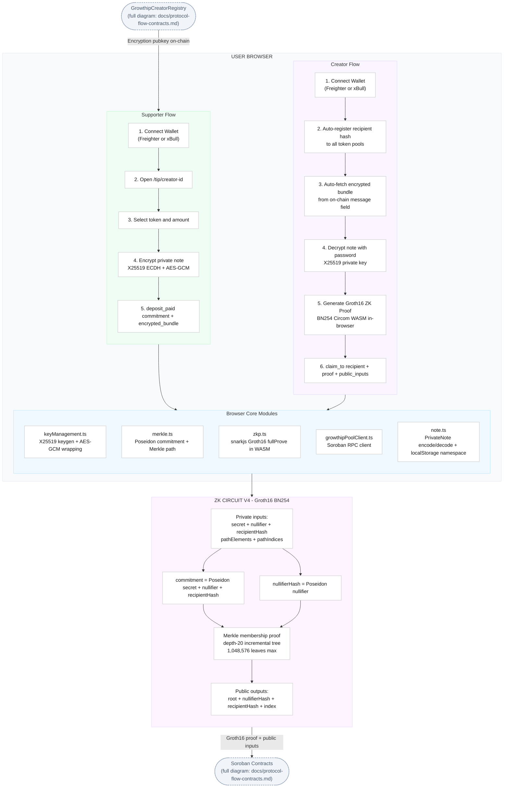

# Protocol Flow — Browser / Frontend

> Part of the Growthip documentation set. See the [root README](../README.md) for the project overview.

> This is the **browser-side half** of the end-to-end flow — note
> encryption, Merkle path construction, and Groth16 proof generation,
> all client-side with no backend. For what happens once a transaction
> reaches Soroban, see
> [docs/protocol-flow-contracts.md](protocol-flow-contracts.md).

---

## Browser & ZK Circuit Flow Diagram

> **Note:** the diagram label above was corrected from a stale "V3.1" to
> "V4" during this doc split — V4 (depth-20 Merkle tree) is the currently
> active circuit; see [docs/zk-circuit.md](zk-circuit.md) for the full
> circuit version history.

---

## Key Browser Modules

The nodes in the `Core` subgraph above map directly to source files —
see [apps/web/README.md](../apps/web/README.md#key-library-files) for
the full file-by-file breakdown of `src/lib/`, including
`keyManagement.ts`, `merkle.ts`, `zkp.ts`, `growthipPoolClient.ts`, and
`note.ts`.

Nothing in this flow — the `secret`, `nullifier`, or the encryption
private key — ever leaves the browser as plaintext. Proof generation
(4–15 seconds on a typical laptop) and note encryption both run entirely
client-side in WASM / Web Crypto, not on any backend service.
